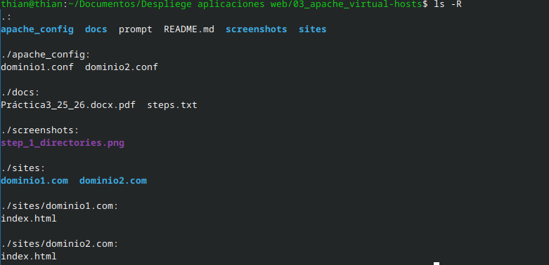
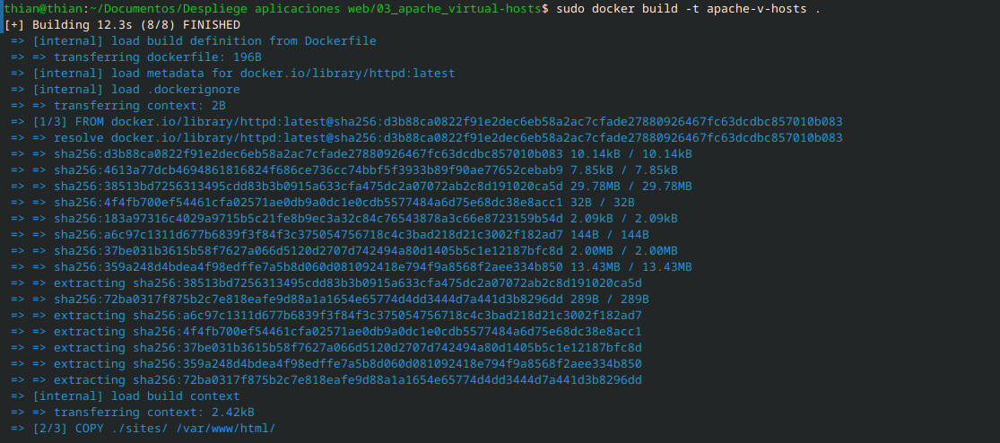
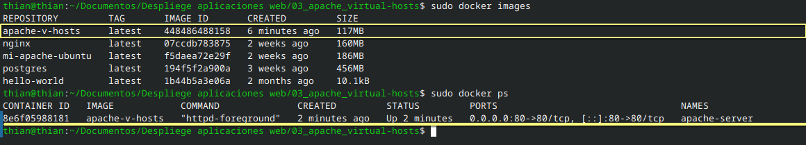
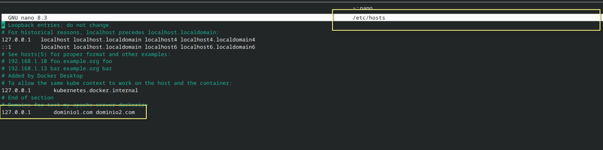
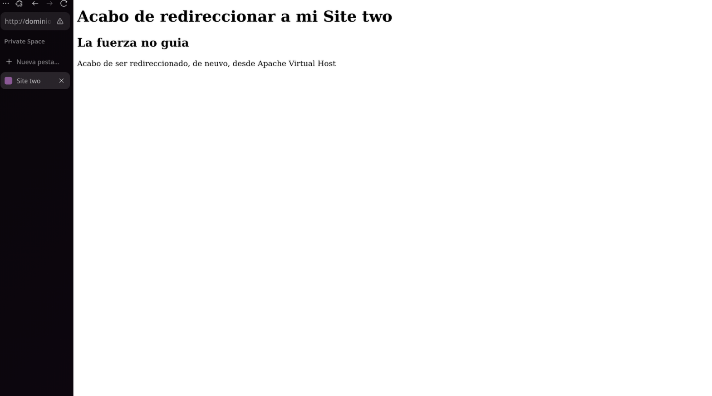

# Apache Virtual Hosts (proyecto)

Este repositorio contiene una práctica para desplegar varios sitios usando Virtual Hosts de Apache dentro de un contenedor Docker (imagen basada en `httpd:2.4`). El objetivo es servir dos sitios independientes (dominio1.com y dominio2.com) desde el mismo servidor Apache usando VirtualHost.

## Qué se hizo
- Se crearon dos sitios estáticos en `sites/dominio1.com/` y `sites/dominio2.com/` con sus respectivos `index.html`.
- Se añadieron los archivos de configuración de VirtualHost en `apache_config/dominio1.conf` y `apache_config/dominio2.conf`.
- Se creó un `Dockerfile` que copia `apache_config/` a `/usr/local/apache2/conf/extra/` y `sites/` a `/usr/local/apache2/htdocs/`, garantiza la inclusión de los vhosts y elimina el `index.html` por defecto para evitar por defecto del servidor.
- Se construyó la imagen (`apache-image:local`) y se ejecutó el contenedor mapeando puertos según las necesidades del entorno de prueba.

## Estructura del proyecto
- `Dockerfile` — fichero para construir la imagen basada en `httpd:2.4`.
- `apache_config/` — contiene `dominio1.conf` y `dominio2.conf` con los VirtualHosts.
- `sites/` — contiene `dominio1.com/index.html` y `dominio2.com/index.html`.
- `screenshots/` — capturas usadas en la práctica. Hay un `screenshots/INDEX.md` que indexa estas imágenes.

## Requisitos
- Docker instalado y funcional (permiso para ejecutar `docker` o usar `sudo`).
- Entradas en `/etc/hosts` para los dominios de prueba (ejemplo en la sección dedicada más abajo).
- Puerto 80 o 8080 libre en el host según cómo se quiera mapear el contenedor.

---

## Metodología y desarrollo del trabajo

1) Organización de los recursos

Se organizó la aplicación en carpetas separadas: el contenido estático en `sites/`, y las configuraciones de Apache en `apache_config/`.  
Esto facilita mantener cada sitio en su propio `DocumentRoot` y versionar las configuraciones.

Estructura del proyecto:



2) Creación de los VirtualHosts y Dockerfile

Se escribieron los dos archivos de VirtualHost (`dominio1.conf`, `dominio2.conf`) apuntando a `/usr/local/apache2/htdocs/dominio1.com` y `/usr/local/apache2/htdocs/dominio2.com`.  
El `Dockerfile` copia ambos directorios al sistema de ficheros de la imagen y asegura que sólo se incluyan los vhosts personalizados, además de eliminar el `index.html` por defecto para evitar la página genérica.

Build (log visual):  



3) Ejecución y despliegue en contenedor

El contenedor se lanzó mapeando el puerto requerido (en entorno de pruebas se utilizó `80:80` para que `http://dominio1.com/` y `http://dominio2.com/` funcionen sin especificar puerto).  
Se comprobó que Apache carga los VirtualHosts y que las rutas contienen los `index.html` esperados.

Contenedor Apache en ejecución:  


4) Verificación de la imagen en el host

Se comprobó la presencia de la imagen construida y de otras imágenes relevantes en el sistema durante las pruebas.

Imágenes Docker locales  



---

## Configuración de `/etc/hosts` (explicación y evidencia)

Para que los dominios de prueba resuelvan a la máquina local durante la evaluación, es obligatorio editar `/etc/hosts` y añadir entradas que apunten los nombres de dominio a `127.0.0.1` (y opcionalmente `::1` para IPv6). Esto permite usar nombres reales como `dominio1.com` en el navegador sin necesidad de DNS público.

Ejemplo de las líneas añadidas:

```
127.0.0.1 dominio1.com dominio2.com
```

Evidencia (captura): edición de `/etc/hosts` realizada durante la práctica



Explicación de la captura: la imagen muestra la edición con `nano` donde se añadieron las entradas. En el informe se indica que se debe hacer copia de seguridad de `/etc/hosts` antes de modificarlo y que las líneas deben añadirse con privilegios de superusuario.

---

## Evidencias finales: páginas servidas

A continuación se incluyen las capturas que muestran las páginas servidas por cada VirtualHost tras el despliegue.

Página servida por `dominio1.com`:


Página servida por `dominio2.com`:



---

## Conclusiones y recomendaciones
- El uso de VirtualHosts en Apache dentro de un contenedor Docker permite servir múltiples sitios desde una única instancia de Apache, manteniendo aisladas las configuraciones y los contenidos.
- Para facilitar el desarrollo, montar `sites/` y `apache_config/` como volúmenes en lugar de copiarlos a la imagen permite editar en caliente sin reconstruir la imagen.
- En entornos reales de producción, añadir un proxy reverso (Nginx) y TLS (por ejemplo con `certbot`) es recomendable.
